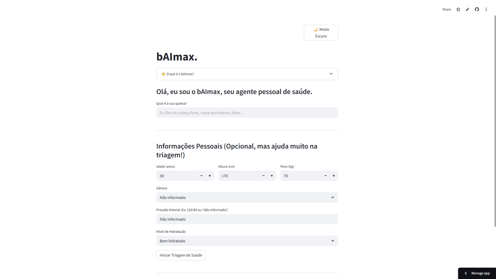

# bAImax - Seu Agente Pessoal de Saúde

<div align="center">
  <a href="https://baimax.streamlit.app/">
    
  </a>
</div>


Preview:



[](https://shields.io/)
## ⚕️ Sobre o bAImax

O bAImax é um agente pessoal de saúde projetado para auxiliar na triagem inicial de possíveis causas para os seus sintomas. Através de uma interface intuitiva, o bAImax gera um relatório preliminar, oferecendo uma visão geral das potenciais causas relacionadas ao sintoma inserido.

**É crucial entender que o bAImax não substitui a consulta com um profissional de saúde.** O relatório gerado é apenas uma triagem inicial e serve como um ponto de partida para buscar orientação médica qualificada.

## ✨ Funcionalidades

* **Análise de Sintomas:** Permite ao usuário inserir um sintoma específico.
* **Geração de Relatório de Triagem:** Produz um relatório com possíveis causas para o sintoma informado.
* **Informações sobre clínicas/hospitais** Fornece informações sobre clínias perto do seu endereço, com um link da rota. 
* **Ênfase na Consulta Médica:** Reforça a importância de procurar um profissional de saúde para diagnóstico e tratamento adequados.

## 🛠️ Tecnologias Utilizadas

* [**Google Gemini API:**] (https://ai.google.dev/) Utilizada para o processamento de linguagem natural e geração dos relatórios de triagem.
* [**Streamlit:**](https://streamlit.io/) Framework Python para a criação da interface web interativa.
* [**Python**] (https://www.python.org/) Linguagem de progrmação

## 🚀 Como Usar

Para testar a aplicação basta clicar no link: https://baimax.streamlit.app/

1.  Forneça o sintoma que você está experimentando na interface.
2.  O bAImax processará a informação e gerará um relatório de triagem inicial.
3.  Forneça seu endereço
4.  O bAImax recomendará clínicas/hospitais especializados perto do seu endereço, e um link da rota no Maps
5.  **Importante:** O relatório pode servir como uma informação inicial para discutir com um médico profissional.

## ⚙️ Instalação

Para executar o bAImax localmente, siga os passos abaixo:

1.  **Clone o repositório:**
    ```bash
    git clone [https://github.com/Moranggoo/bAImax.git](https://github.com/Moranggoo/bAImax.git)
    ```
2.  **Navegue até o diretório do projeto:**
    ```bash
    cd bAImax
    ```
3.  **Crie um ambiente virtual (recomendado):**
    ```bash
    python -m venv venv
    ```
4.  **Ative o ambiente virtual:**
    * No Linux/macOS:
        ```bash
        source venv/bin/activate
        ```
    * No Windows:
        ```bash
        venv\Scripts\activate
        ```
5.  **Instale as dependências:**
    ```bash
    pip install -r requirements.txt
    ```
    *(Certifique-se de ter um arquivo `requirements.txt` com as dependências do seu projeto)*
    
6.  **Configurar a Chave de API:**
    * Este projeto requer uma chave de API para funcionar.
    * Obtenha sua própria chave de API em https://aistudio.google.com/apikey.
    * Dentro da pasta `.streamlit` crie um arquibo chamado `secrets.toml`
    * Adicione sua chave de API ao arquivo `.toml` da seguinte forma:
        ```
        GOOGLE_API_KEY="SUA_CHAVE_DE_API"
        ```


## ▶️ Execução

Para rodar o bAImax, execute o seguinte comando no terminal:

```bash
streamlit run baimax_main.py
````

##🤔 Contexo do projeto

Este projeto foi iniciado durante a **Imersão IA_**, fruto de uma parceria do Google Gemini com a Alura.

##🤝 Contribuição
Contribuições são bem-vindas! Se você tiver ideias para melhorar o bAImax, sinta-se à vontade para abrir uma issue ou enviar um pull request.

##⚠️ Aviso Importante
O bAImax fornece informações de triagem inicial e não substitui o aconselhamento médico profissional. Consulte sempre um profissional de saúde qualificado para diagnóstico e tratamento.

##📄 Licença
MIT License
